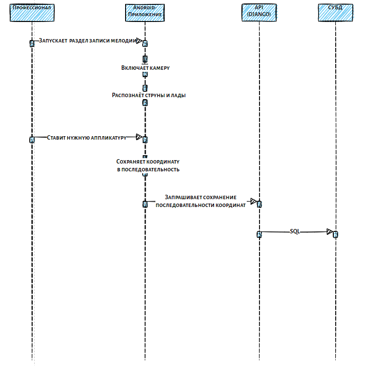

# Предусловия
* Пользователь должен быть зарегистрирован и авторизован
* Должна быть камера
* На входе кадры видеоизображения

# Постусловия
* Видеоизображение, на котором отмечены подсказки
* Координаты расположения пальцев

# Диаграмма последовательностей

# Сценарий

Со стороны начинающего

* Начинающий запускает приложение
* Приложение запрашивает все мелодии с базы данных
* База данных отправляет все мелодии приложению
* Приложение отображает все мелодии
* Начинающий выбирает мелодию 
* Приложение запрашивает информацию о мелодии
* База данных отправляет координаты (лад, струна) системе компьютерного зрения
* Система компьютерного зрения показывает метки на видеоизображении
* Приложение показывает видео
* Начинающий ставить руки на метки
* Приложение сохраняет координаты 
* Система компьютерного зрения сохраняет мелодию как сыгранную

Со стороны профессионала

* Профессионал запускает раздел записи мелодии
* Приложение включает видео
* Профессионал ставит нужную аппликатуру
* Система компьютерного зрения сохраняет координаты

