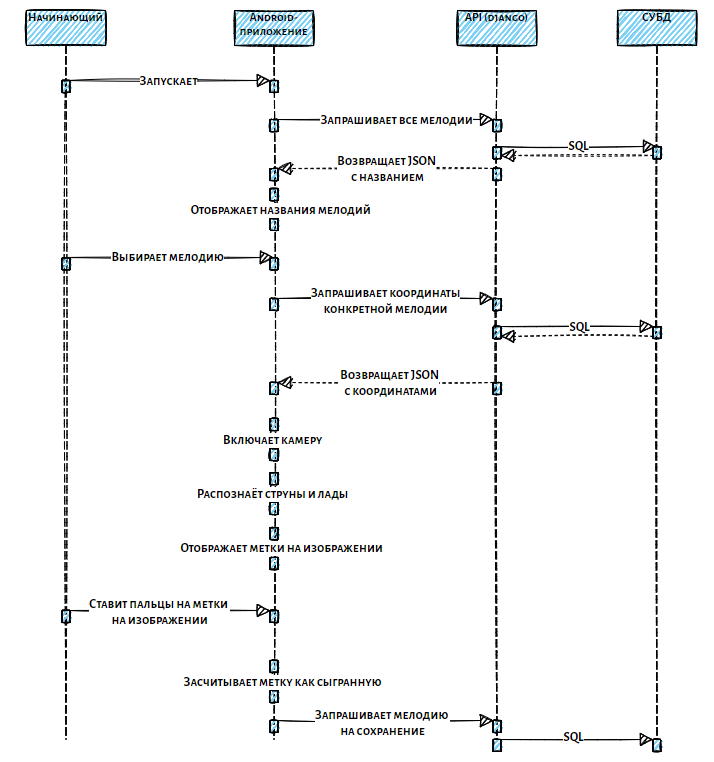

# Предусловия
* Пользователь должен быть зарегистрирован и авторизован
* Должна быть камера
* На входе кадры видеоизображения

# Постусловия
* Видеоизображение, на котором отмечены подсказки
* Координаты расположения пальцев

# Диаграмма последовательностей

# BPMN

# Сценарий

Со стороны начинающего

* Начинающий запускает приложение
* Приложение запрашивает все мелодии по API
* API делает SQL-запрос к СУБД
* API возвращает JSON с информацией о мелодии
* Приложение отображает названия всех мелодий
* Начинающий выбирает мелодию
* Приложение делает запрос на получение координат конкретной мелодии
* API делает SQL-запрос к СУБД
* API возвращает JSON с координатами мелодии
* Приложение включает камеру
* Приложение распознаёт струны и лады 
* Приложение отображает метки на изображении
* Начинающий ставит пальцы на метки на изображении
* Приложение засчитывает метку как сыгранную
* Приложение запрашивает мелодию на сохранение по API
* API делает SQL-запрос, сохраняя мелодию как сыгранную

Со стороны профессионала

* Профессионал запускает раздел записи мелодии
* Приложение включает камеру
* Приложение распознаёт струны и лады
* Профессионал ставит нужную аппликатуру
* Приложение сохраняет координату в последовательность
* Приложение запрашивает сохранение последовательности координат по API
* API делает SQL-запрос на сохранение мелодии

